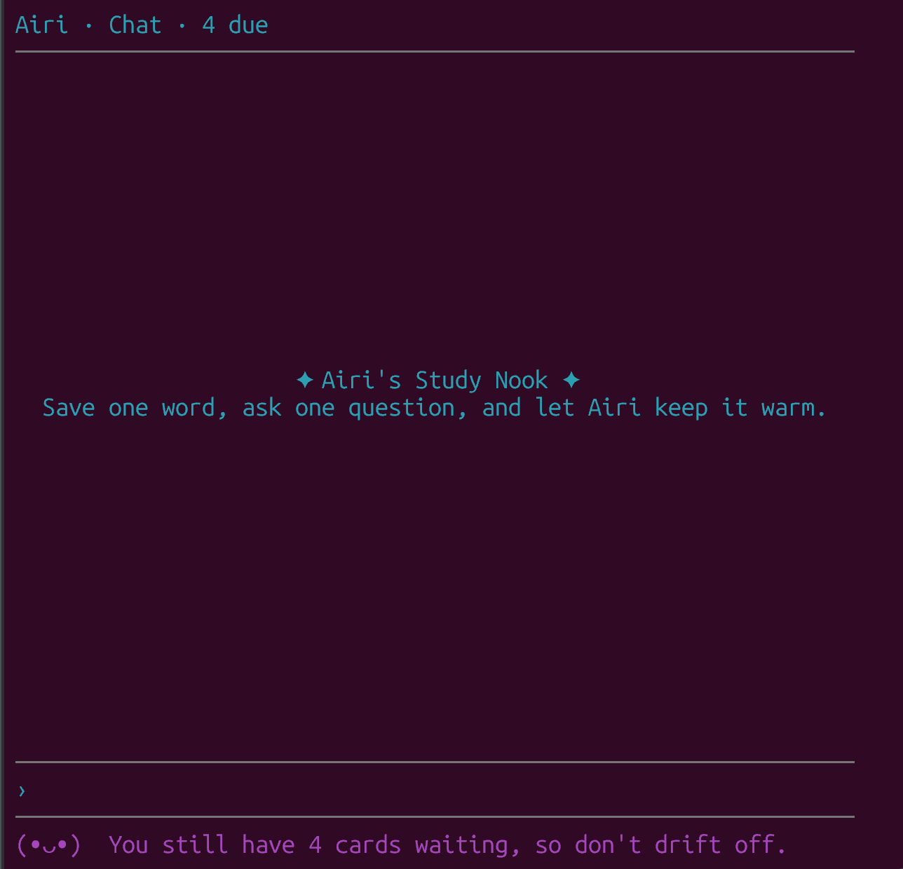
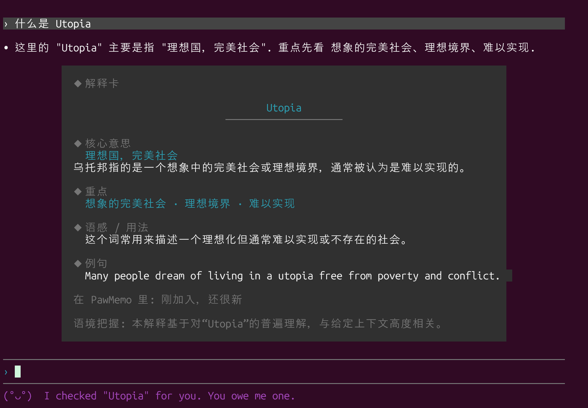
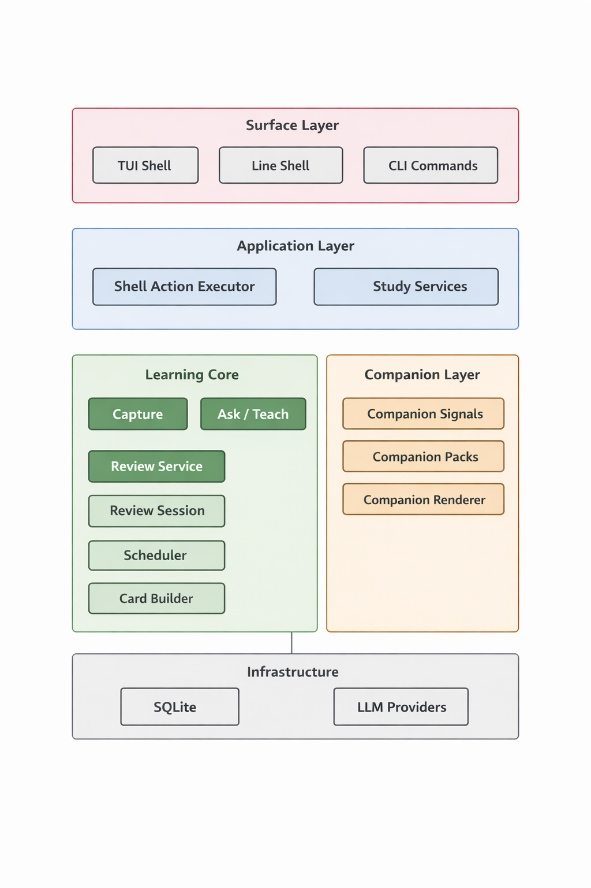

# PawMemo

<p align="center">
  
</p>

LLM-native vocabulary companion for the terminal.

PawMemo is a terminal app for word learning with two fixed parts:

- character-style chat and teaching
- FSRS-style spaced review with local study state

It uses an LLM for the main product experience, while keeping word state, cards, and review progress in SQLite.

Current positioning:

- Anki-like vocabulary cards
- an explicit FSRS-style scheduler direction
- customizable character packs on top of one deterministic study system

## Install

```bash
npm install
npm run build
npm link
```

Run:

```bash
pawmemo
```

Or package it:

```bash
npm pack
npm install -g ./pawmemo-0.1.0.tgz
pawmemo
```

## Setup

PawMemo requires an LLM provider.

```bash
pawmemo config llm
pawmemo config llm use --provider openai --model gpt-5-mini --api-key "your-key"
```

## Quick Start

Capture a word:

```bash
pawmemo capture luminous --ctx "The jellyfish gave off a luminous glow." --gloss "emitting light"
```

Start the shell:

```bash
pawmemo
```

Common commands:

```text
/help
/review
/rescue
/stats
/models
/quit
```

Direct commands:

```bash
pawmemo ask luminous --ctx "The jellyfish gave off a luminous glow."
pawmemo teach lucid --ctx "Her explanation was lucid and easy to follow."
pawmemo review
pawmemo rescue
pawmemo stats
```

Use a temporary database while testing:

```bash
pawmemo --db /tmp/pawmemo-dev.db
```

Use line mode if full-screen TUI does not work well in your terminal:

```bash
pawmemo --line --db /tmp/pawmemo-dev.db
```

Default landing view:



## Main Commands

* `pawmemo` — open the shell
* `capture` — save a word, context, and gloss
* `review` — run review
* `rescue` — recover one overdue item
* `ask` — explain a word in context
* `teach` — teach and save into study state
* `stats` — show study progress
* `pet` — show companion status

Example explanation card in the shell:



## Companion Packs

Built-in packs:

* `momo`
* `girlfriend` (`Mina`)
* `tsundere` (`Airi`)

Preview tone snapshots:

`momo`

```text
> 你好

• 你好！很高兴见到你。
```

`girlfriend` / `Mina`

```text
> 你好

• 你好呀。我在这里，准备好了。
```

`tsundere` / `Airi`

```text
> 你好

• 哦，你终于来了。别在那打招呼了，赶紧把剩下的4个复习完，我可没时间一直陪你耗着。
```

Examples:

```bash
pawmemo config companion list
pawmemo config companion --pack tsundere
pawmemo pet --pack tsundere
```

## Architecture



PawMemo is structured around one local study engine that both the shell and direct CLI commands use.

The core architecture today is:

- explicit study state stored in SQLite
- Anki-style recognition and cloze cards
- a deterministic, stability-aware, FSRS-style scheduler direction
- LLM-assisted explanation and teaching on top of the same saved word state
- companion packs layered downstream of study truth rather than owning it

So the shortest accurate description is:

- a local-first vocabulary CLI
- with Anki-style cards
- an FSRS-style review engine
- and customizable companion roles

More precise wording:

- PawMemo is not claiming to be a drop-in FSRS implementation
- it is claiming the current scheduler is PawMemo's own explicit implementation, designed in an FSRS-style direction rather than as ad hoc cooldown timers
- companion packs can change tone, copy, and presentation, but they do not change review scheduling or canonical study state


## Development

```bash
npm run build
npm run typecheck
npm run lint
npm test
npm pack
```

## CI And Release Packaging

GitHub Actions should verify every push to `main` and every pull request with:

```bash
npm ci
npm run typecheck
npm run lint
npm test
npm pack
```

Creating and pushing a version tag such as `v0.1.0` should build the package tarball and attach it to the matching GitHub Release.

```text
assets/readme/     README images
src/cli/          shell and commands
src/core/         domain logic
src/storage/      SQLite storage
src/review/       cards and scheduler
src/companion/    packs and rendering
test/             tests
```

## License

MIT. See [LICENSE](./LICENSE).
