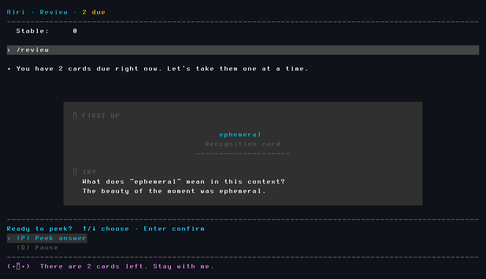
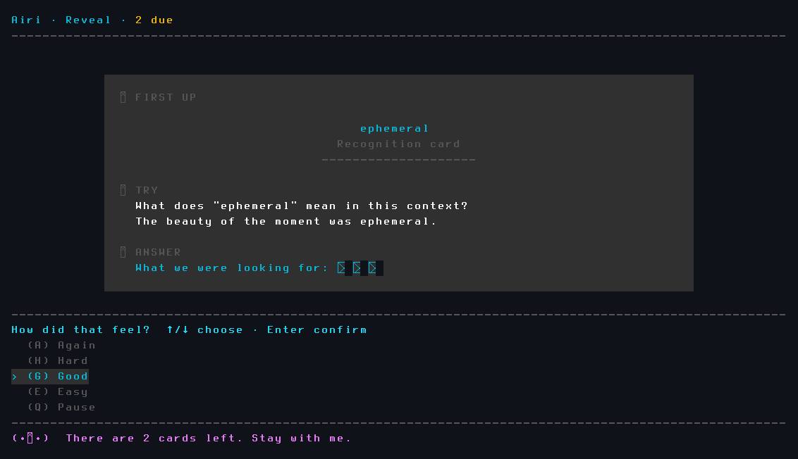
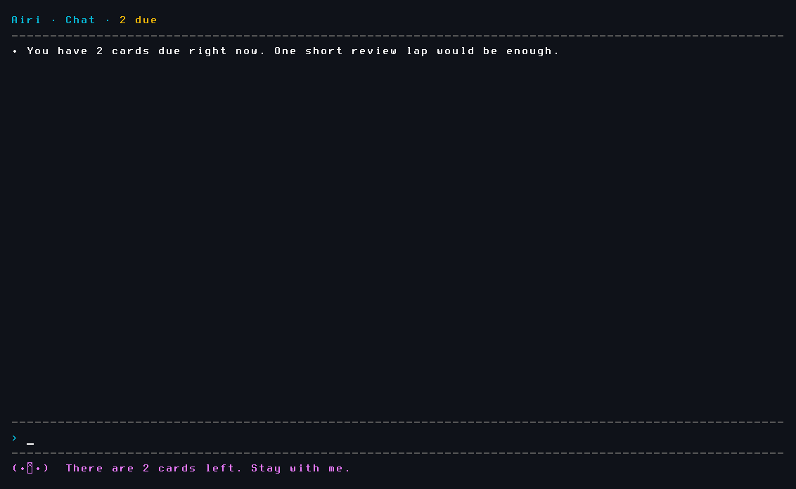
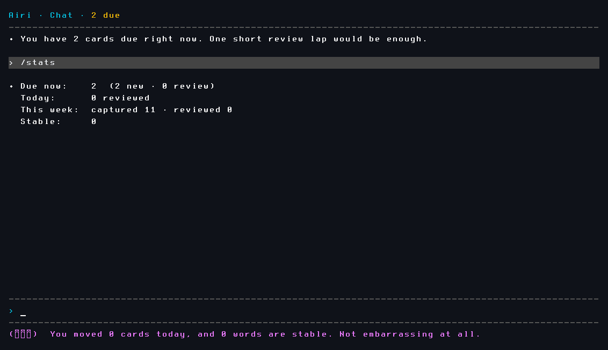

# PawMemo

<p align="center">
  
</p>

<p align="center">
  <strong>A terminal vocabulary companion — with character.</strong><br>
  Capture words in context. Review with FSRS. Get nagged by a companion who has opinions about your study habits.
</p>

<p align="center">
  
  
  
</p>

---

## Review cards, not flashcard apps

<p align="center">
  
</p>

PawMemo shows you a word in its original context and asks you to recall the meaning. When you're ready, peek the answer — then rate it honestly.

<p align="center">
  
</p>

Four ratings: **Again · Hard · Good · Easy**. The scheduler (FSRS-style, stability-aware) decides when you see it next. All state lives in a local SQLite file — nothing leaves your machine.

---

## A companion that stays in character

<p align="center">
  
</p>

The companion layer sits on top of the study engine. It can change tone, copy, and presentation — but it cannot change your review schedule or your word state. Three built-in packs:

| Pack | Character | Tone |
|------|-----------|------|
| `momo` | Momo | Calm, minimal |
| `girlfriend` | Mina | Present, warm |
| `tsundere` | Airi | She's doing you a favor |

```bash
pawmemo config companion --pack tsundere
```

Airi makes her feelings known:

```
(｀_´)  哦，你终于来了。别在那打招呼了，赶紧把剩下的4个复习完，
        我可没时间一直陪你耗着。
```

---

## Study progress, always local

<p align="center">
  
</p>

`/stats` shows what's due, what you've reviewed today, and how many words have stabilized into long-term memory.

---

## Install

```bash
npm install && npm run build && npm link
```

Or from the packed tarball:

```bash
npm pack
npm install -g ./pawmemo-0.1.0.tgz
```

**Configure an LLM provider** (used for `ask`, `teach`, and companion chat):

```bash
pawmemo config llm use --provider openai --model gpt-4o-mini --api-key "sk-..."
```

---

## Quick Start

```bash
# Save a word with context
pawmemo capture ephemeral --ctx "The beauty of the moment was ephemeral." --gloss "lasting a very short time"

# Ask your companion to explain it
pawmemo ask ephemeral --ctx "The beauty of the moment was ephemeral."

# Open the shell
pawmemo

# Inside the shell
/review     # start a review session
/rescue     # recover one overdue card
/stats      # study progress
/help       # all commands
```

---

## Commands

| Command | What it does |
|---------|-------------|
| `pawmemo` | Open the interactive shell |
| `pawmemo capture <word>` | Save a word with context and gloss |
| `pawmemo ask <word>` | Explain a word (no save) |
| `pawmemo teach <word>` | Teach and save into study state |
| `pawmemo review` | Run a review session |
| `pawmemo rescue` | Recover one overdue item |
| `pawmemo stats` | Show study progress |
| `pawmemo pet` | Check companion status |

Flags: `--db <path>` for a custom database path, `--line` for non-TUI terminals.

---

<details>
<summary><strong>Architecture</strong></summary>

<br>

PawMemo is structured around one local study engine shared by the shell, direct CLI commands, and all companion packs.

```
src/cli/          shell and commands
src/core/         domain logic
src/storage/      SQLite storage
src/review/       cards and scheduler
src/companion/    packs and rendering
test/             tests
```

- Study state lives in SQLite — companion packs cannot change review scheduling or canonical word state
- FSRS-style scheduler: stability-aware, deterministic, not ad hoc cooldown timers
- LLM is a presentation layer only — explanation, teaching, companion tone — all downstream of study truth

</details>

<details>
<summary><strong>Development</strong></summary>

<br>

```bash
npm run build
npm run typecheck
npm run lint
npm test
npm pack
```

**CI (every push to `main`):**

```bash
npm ci && npm run typecheck && npm run lint && npm test && npm pack
```

Pushing a version tag like `v0.1.0` builds the tarball and attaches it to the matching GitHub Release.

Local proxy (WSL → Windows OpenAI-compatible reverse proxy):

```bash
pawmemo config llm url --provider openai --api-url http://172.24.160.1:7861/v1
```

</details>

---

## License

MIT. See [LICENSE](./LICENSE).
